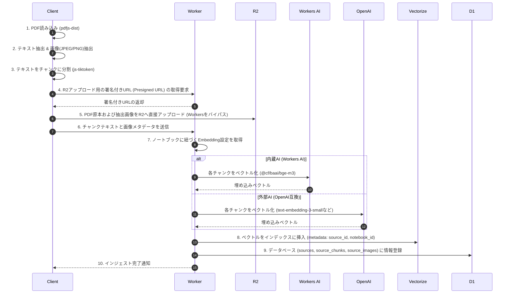

# 全体アーキテクチャ設計

本ドキュメントは、Cloudflareのサーバーレススタックを用いた open-notebook の全体システム連携、データインジェスト、RAG、および MCP サーバーの設計詳細を記述します。

---

## 1. コンポーネントマッピングと役割分担

サーバー側の制約（Workersの128MBメモリ制限、最大CPU実行時間など）をクリアしつつ、スケーラビリティを担保するため、重い前処理はすべてブラウザ（クライアント）側で処理します。

| 機能/要素 | 技術スタック | 役割・特徴 |
| :--- | :--- | :--- |
| **Frontend Framework** | **TanStack Router (CSR)** | React ベースのクライアントサイドルーティング。TanStack Router による型安全なルーティング。SSR は使用せず、Workers Static Assets で配信。 |
| **Styling** | **Tailwind CSS** | ユーティリティファーストのCSSフレームワークによるモダンUI構築。 |
| **PDFテキスト＆画像抽出** | **ブラウザ (クライアント)** | `pdfjs-dist` を使用し、ブラウザ上でPDFからテキストおよび埋め込み画像を直接抽出。Workersのメモリ制限を完全に回避。 |
| **テキストチャンキング** | **ブラウザ (クライアント)** | `js-tiktoken` 等を使用し、トークンカウントを意識したチャンク分割をブラウザ上で実行。 |
| **Backend API / Server** | **Cloudflare Workers (Hono)** | Hono を介して、エッジAPIサーバーとして動作。D1, R2, Vectorize へのアクセスを担当。MCPサーバーエンドポイントもここに含まれます。 |
| **オブジェクトストレージ** | **Cloudflare R2** | 互換性の高いオブジェクトストレージ。PDF原本、抽出された画像の保存。 |
| **ベクトルデータベース** | **Cloudflare Vectorize** | RAG用の埋め込みベクトル保存とコサイン類似度検索。 |
| **内蔵AI推論エンジン** | **Cloudflare Workers AI** | エッジで実行される推論エンジン。Llama 3 (LLM), BGE Embeddings。APIキー不要で即座に動作。 |
| **外部AI連携** | **OpenAI互換API** | `OpenAI SDK` または `fetch` を介し、外部プロバイダー（OpenAI, DeepSeek, Ollama, Gemini等）のAPIキーとベースURLを設定して動作。 |
| **MCP サーバー** | **Model Context Protocol** | Workersの `/api/mcp` エンドポイントを介して、外部のAIエージェント（CursorやClaude Desktop等）にデータ接続・検索ツールを提供。 |

---

## 2. ドキュメント・インジェストパイプライン

最も負荷の高いドキュメント解析とチャンキングをクライアントにオフロードし、バックエンドはデータベース保存とベクトル化のみに専念させます。



---

## 3. RAG（質問応答）の実装

チャットでの質問時に、設定されたプロバイダーを使用して関連するコンテキストを抽出し、LLMに問い合わせます。

```mermaid
flowchart TD
    Request([AI処理リクエスト]) --> GetSettings[ノートブックの設定情報をD1から取得]
    GetSettings --> CheckType{リクエスト種別判定}
    
    CheckType -->|1. 通常RAGチャット| ChatFlow[Chat用 LLM / Embedding モデルの選定]
    ChatFlow --> ChatEmbed[質問をベクトル化]
    ChatEmbed --> VectorSearch[Vectorizeで類似チャンクをコサイン類似度検索]
    VectorSearch --> CombineContext[上位コンテキストをプロンプトに結合]
    CombineContext --> CheckProvider1{プロバイダー判定}
    CheckProvider1 -->|Workers AI| ChatWA[@cf/meta/llama-3-8b-instruct 等で回答生成]
    CheckProvider1 -->|外部 OpenAI互換| ChatExt[gpt-4o-mini 等で回答生成]
    
    CheckType -->|2. 要約・ノート自動生成| SumFlow[要約用 LLM モデルの選定]
    SumFlow --> FetchFullText[D1から全テキストを取得]
    FetchFullText --> CheckProvider2{プロバイダー判定}
    CheckProvider2 -->|Workers AI| SumWA[Workers AI で要約生成]
    CheckProvider2 -->|外部 OpenAI互換| SumExt[gemini-1.5-pro / gpt-4o 等で要約生成]
    
    ChatWA --> Response([ストリーミング回答返却])
    ChatExt --> Response
    SumWA --> Response
    SumExt --> Response
```

- **RAGチャット**: 応答の即時性・速度重視。質問をベクトル化し、Vectorizeでノートブック内のテキストを絞り込み検索。`gpt-4o-mini` や `llama-3-8b-instruct` などの高速モデルで回答生成。
- **要約・分析**: コンテキスト容量と精度重視。ソースデータから抽出テキストをすべて読み込み、`gemini-1.5-pro` などの長文対応モデルを用いて全体要約や主要ポイントを抽出。

---

## 4. MCP (Model Context Protocol) サーバー機能

ローカルで動いている AI エージェント（Claude Desktop, Cursor 等）がノートブック情報に直接アクセスできるようにするためのエッジMCPサーバー設計です。

### 4.1 トランスポート
- Cloudflare Workers の `/api/mcp` エンドポイントを介して、HTTP SSE (Server-Sent Events) トランスポートを使用した双方向の JSON-RPC 2.0 通信を行います。

### 4.2 提供するスキーマ定義
- **リソース (Resources)**: 外部AIが読み込み可能なドキュメント。
  - `notebook://{notebook_id}/list`: ノートブック内のソース・メモのメタデータ一覧。
  - `notebook://{notebook_id}/sources/{source_id}`: アップロードされた特定ソースのプレーンテキスト。
  - `notebook://{notebook_id}/notes/{note_id}`: ユーザーが作成した特定メモのコンテンツ。
- **ツール (Tools)**: 外部AIが実行可能なアクション。
  - `search_sources`: 引数 `query` に基づいてノートブック内をセマンティック検索（Vectorize）し、関連度の高いテキストを返却。
  - `create_note`/`update_note`: 外部AIが自立的にメモをデータベースに追加・更新。
  - `get_notebook_summary`: ドキュメント全体の事前要約をロード。
- **プロンプト (Prompts)**:
  - `analyze_sources`: ドキュメントを横断分析するための事前テンプレート。
