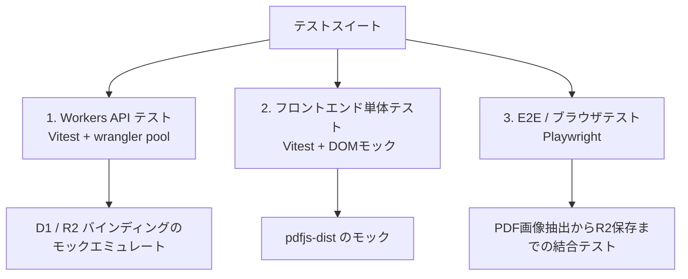

# 開発ロードマップ ＆ テスト計画

本ドキュメントは、pnpm モノレポ構造の立ち上げ、短期・中期・長期の実装ステップ、テスト計画、およびローカル開発やクローラー規制に対する技術的考慮事項を記述します。

---

## 1. プロジェクト構造とパッケージ構成

パッケージ管理には **pnpm** を採用し、同一リポジトリでフロントエンドとバックエンドのコードを共有するモノレポ構成（pnpm workspaces）で管理します。

### 1.1 ディレクトリツリー
```
/
├── pnpm-workspace.yaml  # ワークスペース定義
├── package.json         # ルート定義（スクリプト集約）
└── packages/
    ├── frontend/        # TanStack Router (React + Tailwind CSS + pdfjs-dist, CSR only)
    │   ├── package.json
    │   └── app/
    └── backend/         # Cloudflare Workers (Hono + D1/R2/Vectorize)
        ├── package.json
        └── src/
```

### 1.2 設定ファイル
- **`pnpm-workspace.yaml`**:
  ```yaml
  packages:
    - 'packages/*'
  ```
- **`package.json` (ルート)**:
  ```json
  {
    "name": "cloud-notebook",
    "private": true,
    "scripts": {
      "dev:frontend": "pnpm --filter frontend dev",
      "dev:backend": "pnpm --filter backend dev",
      "build:frontend": "pnpm --filter frontend build",
      "build:backend": "pnpm --filter backend build",
      "test:frontend": "pnpm --filter frontend test",
      "test:backend": "pnpm --filter backend test"
    }
  }
  ```

---

## 2. 開発ロードマップとマイルストーン

### 2.1 短期計画 (Short-Term: 1〜2週間)
**目標**: モノレポ基盤の確立と、クライアントサイド解析を用いたドキュメント・インジェストの基本フローの完成。
- **タスク**:
  - モノレポ環境の初期化と各パッケージ（フロント/バック）の設定。
  - D1 データベーススキーマの構築（初期マイグレーション）。
  - `pdfjs-dist` を用いたブラウザ上での PDF テキスト・画像抽出の実装。
  - `js-tiktoken` によるブラウザ側トークンチャンキングの実装。
  - Workers側での R2 署名付きURL（PUT）生成APIの実装と、クライアントからのダイレクトアップロードの実装。
  - `Vitest` を用いた API / 解析ヘルパー関数の単体テスト構築。

### 2.2 中期計画 (Medium-Term: 2〜4週間)
**目標**: ベクトル検索（RAG）の導入、セキュリティ認証の確立、および外部エージェント用 MCP サーバーの統合。
- **タスク**:
  - Workers AI / OpenAI 互換 API による Embedding・Vectorize 登録処理の実装。
  - `Vectorize` によるコサイン類似度検索と、LLMによる回答のストリーミング生成 API の実装。
  - 用途別LLMモデル選択（Chat / Summarize）ロジックのバックエンド・UI実装。
  - Cloudflare Access (JWKS公開鍵検証) を用いた JWT 認証の実装、および D1 での所有権認可（`user_id`）の導入。
  - Workers上での MCP（Model Context Protocol）SSEサーバー実装と、ローカル接続時の認証バイパス設定。
   - TanStack Router (CSR) と Tailwind CSS によるメイン画面および設定 UI の構築。

### 2.3 長期計画 (Long-Term: 1〜2ヶ月)
**目標**: システムの最適化、および統合自動テストスイートによる本番運用の開始。
- **タスク**:
  - クローラー規制対策 (Browser Rendering 等) の導入。
  - D1容量制限を回避するテキストのR2退避設計の最適化。
  - Playwright による E2E テストの構築。
  - GitHub Actions によるデプロイオートメーション（CI/CD）の構築。

---

## 3. テスト計画とテスト環境の設計



### 3.1 バックエンド・APIテスト (Workers)
- **テストフレームワーク**: **Vitest**
- **エミュレーション**: 
  - `@cloudflare/vitest-pool-workers` を使用し、本物の isolated V8 環境に近い状態でテストを実行。
  - インメモリ D1 やローカル R2 / Vectorize が自動でモックバインドされる状態で、API の振る舞いを検証します。

### 3.2 フロントエンド単体テスト (TanStack Router)
- **テストフレームワーク**: **Vitest** + **React Testing Library** + **happy-dom**
- **検証項目**: 
  - `js-tiktoken` を用いたクライアントサイドチャンキングの単体テスト。
  - `pdfjs-dist` をモック化し、PDFオブジェクトからテキストおよび画像抽出ロジックが期待通り働くかの確認。

### 3.3 MCP サーバーテスト
- **テストフレームワーク**: **Vitest** (Workers統合テストの一部として実行)
- **検証項目**: 
  - `/api/mcp` エンドポイントに対し、JSON-RPC 2.0 形式の POST を送った際のレスポンス（`tools/list`, `tools/call`）の正確性。

### 3.4 Playwright による E2E テスト
- **テストフレームワーク**: **Playwright**
- **テストシナリオ**:
  - ログイン -> PDFアップロード -> ブラウザ画像・テキスト抽出 -> R2保存 -> Vectorize同期 -> チャット回答生成までの一連の総合フローを自動テスト化。

---

## 4. その他技術的考慮事項と対策

### 4.1 Workers AI の同時実行（Concurrency）制限
- 大量チャンクの同時ベクトル化時に発生する `429 Too Many Requests` エラーを防ぐため、並行リクエスト制限（Promiseの実行上限数を4〜5に抑える制御）と、指数バックオフリトライロジックを実装します。

### 4.2 クローラーブロック回避
- WebページのURLインジェスト時にクローラーブロックを防ぐため、Cloudflare `browser-rendering` (Headless Chrome) の導入や、YouTubeインジェスト時には公式 API、またはブラウザ（クライアント）側で一度フェッチしてからテキストを投げる方針を想定します。

### 4.3 ローカル開発環境でのMCP接続
- `wrangler dev` (localhost:8787) で動作するローカルMCPサーバーに、開発環境限定（`process.env.NODE_ENV === 'development'`）で Cloudflare Access 認証をバイパスしてダミーのユーザーを返却するデバッグコードを用意します。
